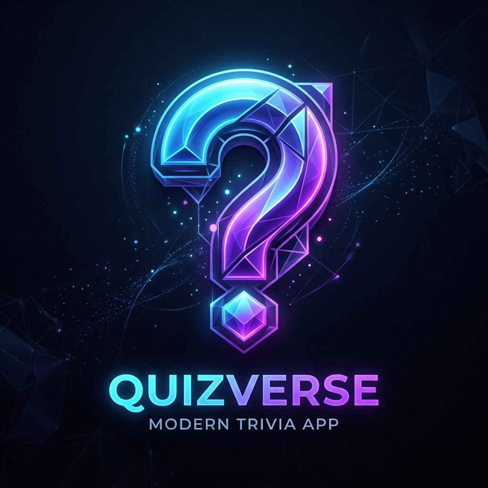
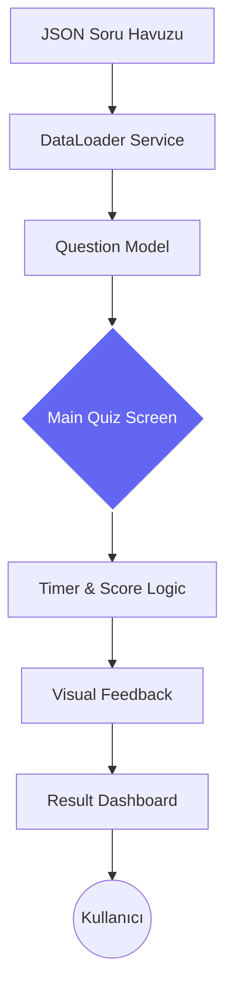

<p align="center">
  
</p>

# <p align="center"><span style="color: #6366f1;">Q U I Z • H U B</span></p>
<p align="center">
  <b>Akademik Değerlendirme • İnteraktif Ölçüm • Modern Mobil Altyapı</b><br/>
  <b>Dinamik Soru Havuzu</b> • <b>Gerçek Zamanlı Analiz</b> • <b>Çoklu Platform Desteği</b>
</p>

<p align="center">
  <a href="https://your-demo-link.com">🌐 Canlı Demo</a> • 
  <a href="#">📖 Dokümantasyon</a> • 
  <a href="https://www.linkedin.com/in/omerabali">💬 LinkedIn</a>
</p>

<p align="center">
  
  
  
  
</p>

<br/>

<p align="center">
  <b>"Bilgiyi Test Edin, Sınırları Zorlayın."</b><br/>
  Öğrencilerin ve teknoloji meraklılarının gelişimini takip eden, yüksek performanslı ve akıcı bir sınav platformu.
</p>

---

## 🎯 QUIZ HUB Nedir? (The Vision)

**QUIZ HUB**, akademisyenler ve öğrenciler arasındaki bilgi köprüsünü dijitalleştiren, uçtan uca optimize edilmiş bir mobil sınav ekosistemidir. Basit bir soru-cevap uygulamasının ötesinde; veriyi dinamik olarak işleyen, kullanıcı performansını anlık olarak ölçen ve "premium" bir deneyim sunan bir öğrenme aracıdır.

### Temel Değer Önerileri (Core Value Props)

1.  **Dynamic Data Pipeline**: Yerel JSON dosyalarından beslenen, her oturumda soruları ve şıkları otonom olarak karıştıran gelişmiş veri motoru.
2.  **Real-time Pressure**: Her soru için 15 saniyelik kritik zaman dilimi ile bilişimsel düşünme ve hızlı karar verme yetilerini tetikler.
3.  **Instant Intelligence Feedback**: Kullanıcı seçimlerini anlık olarak doğrular ve görsel/mikro-animasyonlar ile bilişsel yükü azaltır.
4.  **Multi-Platform Reach**: Android ve iOS'un yanı sıra Web ve Desktop (Windows) üzerinde pürüzsüz çalışma sunan hibrit mimari.

---

## 🏗️ Mimari ve Teknik Altyapı (Architecture & Tech Stack)

QUIZ HUB, modüler ve decoupled (birbirinden ayrılmış) bir yapı üzerine inşa edilmiştir.

### Teknik Katmanlar
- **Data Orchestration layer**: JSON verilerini normalize eden ve dart nesnelerine dönüştüren güçlü bir `DataLoader` katmanı.
- **UI Architecture**: Material 3 standartlarında, Google Fonts (Poppins) ile optimize edilmiş tipografi ve esnek layout yönetimi.
- **State Management**: Uygulama içi akışı yöneten, zamanlayıcı ve skor takibini senkronize eden özel logic blokları.



---

## 🚀 Gelişmiş Özellikler (Advanced Features)

### 🧠 Akıllı Soru Seçimi
Sistemin kalbinde yer alan karıştırma algoritması:
- **Zero-Pattern:** Soruların sıralaması her açılışta rastgele belirlenir.
- **Option Shuffle:** Sadece soru değil, şıklar da dinamik olarak yer değiştirerek ezberciliği önler.

### ⚡ Kesintisiz Deneyim ve Tasarım
- **Micro-Animations:** Doğru/yanlış cevaplarda devreye giren pürüzsüz geçiş efektleri.
- **Responsive Layouts:** Telefon ekranlarından masaüstü tarayıcılara kadar her çözünürlükte optimize edilmiş otomatik ölçeklendirme.
- **Result Metrics:** Skor tablosunda başarı oranı analizi ve kişiselleştirilmiş performans mesajları.

---

## 🛠️ Teknik Envanter (Inventory)

| Bileşen | Teknoloji | Mimari Karar Nedeni |
|:---|:---|:---|
| **Platform** | Flutter 3.x | Tek kod tabanı ile hızlı geliştirme ve yüksek performanslı render. |
| **Dinamik Veri** | JSON Serialization | Hızlı veri okuma, kolay güncellenebilirlik ve offline çalışma kapasitesi. |
| **Logic** | Custom Dart Hooks/Logic | İş mantığının arayüzden soyutlanması ve sürdürülebilir kod yapısı. |
| **Styling** | Material 3 + Google Fonts | Modern, erişilebilir ve göz yormayan kullanıcı arayüzü standartları. |

---

## ⚙️ Kurulum ve Geliştirme (Setup)

```bash
# 1. Projeyi Klonlayın
git clone https://github.com/yourusername/quiz-hub.git

# 2. Bağımlılıkları Normalize Edin
cd quiz-hub && flutter pub get

# 3. Uygulamayı Başlatın
# Mobil (Emülatör/Cihaz)
flutter run

# Web
flutter run -d chrome

# Windows Desktop
flutter run -d windows
```

---

## 👤 Geliştirici (Author)

**Ömer Abalı**

Mobil uygulama geliştirme, modern web mimarileri ve kullanıcı deneyimi (UX) üzerine odaklanmış bir geliştirici.

- 💼 LinkedIn: [linkedin.com/in/omerabali](https://linkedin.com/in/omerabali)
- 🖥️ GitHub: [github.com/omerabali](https://github.com/omerabali)

---

<p align="center">
  <br/>
  <a href="https://www.linkedin.com/in/omerabali" target="_blank">
    
  </a>
  <br/><br/>
  <strong>QUIZ HUB | Bilgiyi Ölç, Geleceği Tasarla.</strong><br/>
  <br/>
  Made with ❤️ for high-performance mobile evaluation.
</p>


<p align="center">
  <table>
    <tr>
      <td></td>
      <td></td>
      <td></td>
    </tr>
  </table>
</p>
